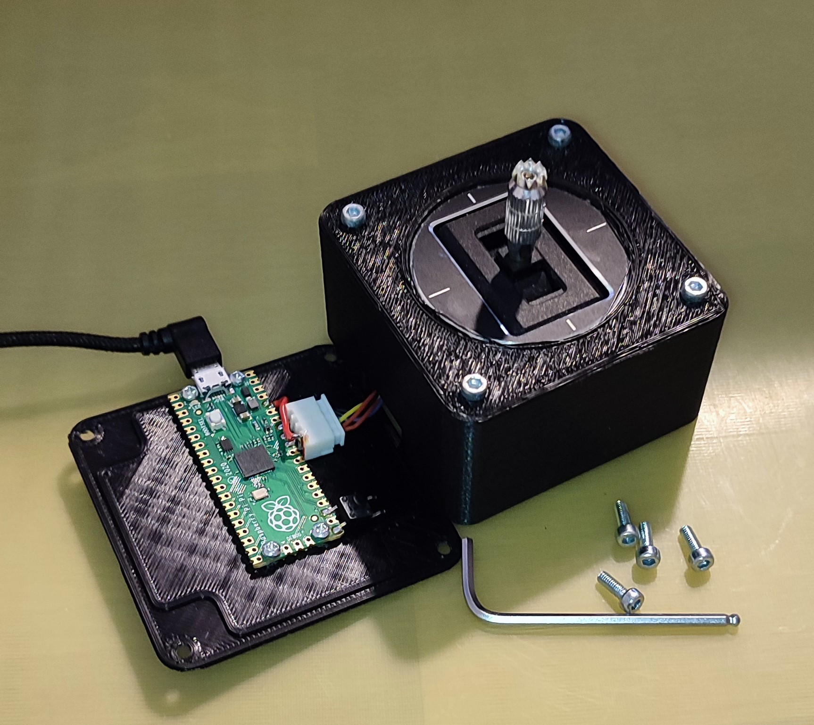

# pi-pico-usb-joystick

## Hardware

- Raspberry Pi Pico
- FrSky Gimbal M9 Hall Sensor for Taranis X9D Plus
- Switch (to enable mass storage device again. For updates etc.)
- 4-pin plug for PCB and gimbal
- Case

## Install CircuitPython on Pi Pico

- Download CircuitPython for Pi Pico (https://circuitpython.org/board/raspberry_pi_pico/).
- Choose Firmware / Releases / Latest.
- Follow the installation instructions at the page.

## Install the application
- Clone or download this repo
- Copy everything from ./src directory into the root of the PP drive.
- Restart PP (Plug out, plug in)

## Develop

(Windows)

- Download and Install Thonny (https://thonny.org/)
- Start Thonny, go to Extras -> Options -> Interpreter and switch to CircuitPython (generic)

The fslock is a singnal to the app to make the FS writeable to PP and reandonly to your PC.

You can remove the file with Thonny.

- Switch View -> Files to checked.
- Delete the fslock file.
- Reboot the PP (power cycle).

## Run with Ubuntu

- https://wiki.ubuntuusers.de/joystick/
